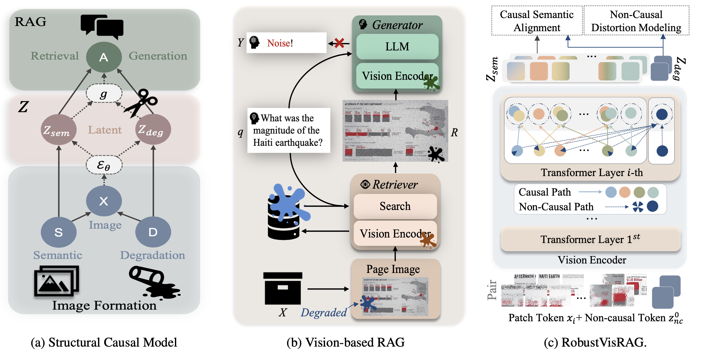

# RobustVisRAG: Causality-Aware Vision-Based Retrieval-Augmented Generation under Visual Degradations
Official repository for RobustVisRAG: Causality-Aware Vision-Based Retrieval-Augmented Generation under Visual Degradations

[Project Page](https://robustvisrag.github.io/) | [Paper](https://arxiv.org/abs/2602.22013) | [Dataset](https://huggingface.co/collections/robustvisrag/distortion-visrag) | [Code](https://github.com/robustvisrag/RobustVisRAG)

## Updates
- April 2026: ✨ DVisRAG dataset and weights was released publicly. 
- February 2026: ✨ RobustVisRAG was accepted into CVPR 2026!

## RobustVisRAG
RobustVisRAG enhances Vision-based Retrieval-Augmented Generation (VisRAG) under visual degradations through causality-guided semantic–degradation disentanglement. By explicitly separating degradation and semantic factors inside the vision encoder, our framework suppresses degradation-induced bias while preserving task-relevant representations — without introducing additional inference cost.



## Inference
Please follow the [VisRAG](https://github.com/openbmb/visrag) pipeline for the inference process.
* Replace the default model with our fine-tuned model [RobustVisRAG](https://huggingface.co/robustvisrag/RobustRAG/tree/main).
* Additionally, make sure to follow the dataset configuration (dataset) when preparing and running the data. 
* Dataset can be found [here](https://github.com/robustvisrag/RobustVisRAG/tree/main/dataset).


## Reference
If you find this work useful, please consider citing us!
```
@misc{chen2026robustvisragcausalityawarevisionbasedretrievalaugmented,
      title={RobustVisRAG: Causality-Aware Vision-Based Retrieval-Augmented Generation under Visual Degradations}, 
      author={I-Hsiang Chen and Yu-Wei Liu and Tse-Yu Wu and Yu-Chien Chiang and Jen-Chien Yang and Wei-Ting Chen},
      year={2026},
      eprint={2602.22013},
      archivePrefix={arXiv},
      primaryClass={cs.CV},
      url={https://arxiv.org/abs/2602.22013}, 
}
```