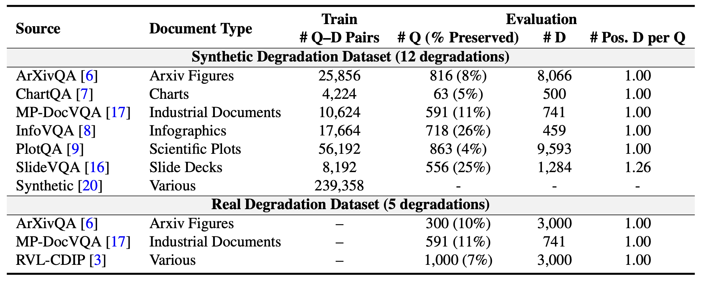

## DVisRAG Dataset
DVisRAG is a document visual retrieval benchmark designed to evaluate robustness under both synthetic and real-world visual degradations. It contains 367,608 question–document (Q–D) pairs in total, including:
- 3,607 synthetic-degradation test samples
- 1,891 real-world degradation test samples
The benchmark covers seven major document VQA domains, summarized below:


## Dataset Access
The full collection is available on [Hugging Face](https://huggingface.co/collections/robustvisrag/distortion-visrag).
You can load each subset with the following code:
```
from datasets import load_dataset

repo_id = "robustvisrag/$subset"
corpus  = load_dataset(repo_id, name="corpus", split="train")
queries = load_dataset(repo_id, name="queries", split="train")
```

Replace $subset with one of the dataset names listed below.

- Available Subsets
    - Synthetic Degradation Dataset (12 degradations)
        - robustvisrag/DVisRAG-Ret-Test-Synthetic-ArxivQA
        - robustvisrag/DVisRAG-Ret-Test-Synthetic-ChartQA
        - robustvisrag/DVisRAG-Ret-Test-Synthetic-MP-DocVQA
        - robustvisrag/DVisRAG-Ret-Test-Synthetic-InfoVQA
        - robustvisrag/DVisRAG-Ret-Test-Synthetic-PlotQA
        - robustvisrag/DVisRAG-Ret-Test-Synthetic-SlideVQA

    - Real-World Degradation Dataset (5 degradations)
        - robustvisrag/DVisRAG-Ret-Test-RealWorld-ArxivQA
        - robustvisrag/DVisRAG-Ret-Test-RealWorld-MP-DocVQA
        - robustvisrag/DVisRAG-Ret-Test-RealWorld-RVL-CDIP

## Acknowledgements 
This work builds upon the following open-source projects: 
- VisRAG: Vision-based Retrieval-augmented Generation on Multi-modality Documents \[[GitHub](https://github.com/openbmb/visrag), [Paper](https://arxiv.org/abs/2410.10594)\], 
- RVL-CDIP: Evaluation of Deep Convolutional Nets for Document Image Classification and Retrieval \[[Data](https://huggingface.co/datasets/aharley/rvl_cdip), [Paper](https://arxiv.org/abs/1502.07058)\] - UniRestore: Unified Perceptual and Task-Oriented Image Restoration Model Using Diffusion Prior \[[Synthetic Function](https://github.com/unirestore/UniRestore/tree/main/src/data/corruption), [Paper](https://arxiv.org/abs/2501.13134)\] 

We sincerely thank the authors for their open-source contributions.